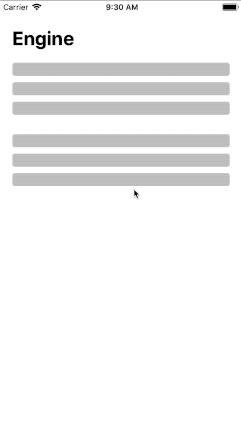

# react-native-animated-engine

[]()
[](https://www.npmjs.com/package/react-native-animated-engine)
[](https://www.npmjs.com/package/react-native-animated-engine)


A react-hooks utility to help build react native animations

## Example app



## Installation
```bash
react-native-animated-engine
```

## Usage

useLoopEngine is designed for those animation running again and again forever. 

```jsx
import { useLoopEngine } from 'react-native-animated-engine';

const App = () => {
  const [loopValue, setBlink] = useLoopEngine();
  return (
    <Animated.View style={{ opacity: loopValue }}>
	  <View style={styles.skeleton}></View>
    </Animated.View>
  )
}
```

You can also bind engine to a scrollView

```jsx
import { useScrollEngine } from 'react-native-animated-engine';

const App = () => {
  const [scrollValue, handleNativeScrollEvent] = useScrollEngine([5, 30]);
  return (
    <ScrollView onScroll={handleNativeScrollEvent} scrollEventThrottle={32}>
      <Animated.View style={[styles.header, { opacity: scrollValue }]}>
        <Header title="Engine" />
      </Animated.View>
    </ScrollView>
  )
}
```

## Running example app (Expo)

```sh
git clone https://github.com/InfiniteXyy/react-native-animated-engine
cd react-native-animated-engine/example-app
yarn
yarn start
```

## License

MIT
